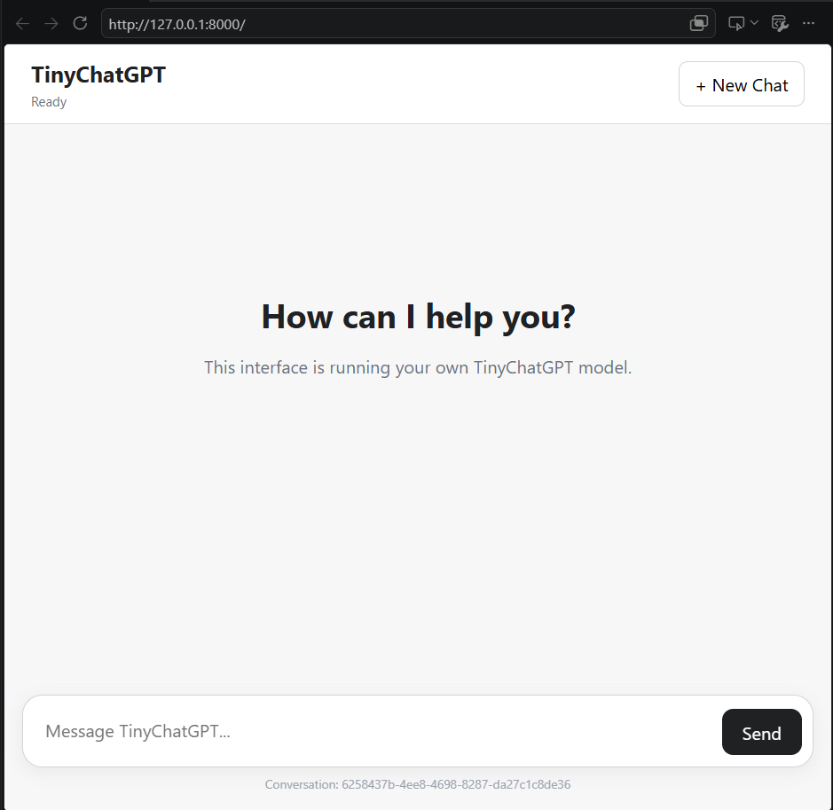

# TinyGPT

TinyGPT is an educational, end-to-end decoder-only GPT implementation built from first principles with PyTorch.

The project is designed to make the complete lifecycle of a modern language model understandable and inspectable — from raw text and tokenization, through Transformer internals and pretraining, to supervised fine-tuning, FastAPI model serving, streaming responses, conversation history, and a ChatGPT-like web interface.

> **Goal:** build a small GPT-style language model that runs on a normal CPU while preserving the same major architectural ideas used by much larger LLM systems.

## Project Demo

The project includes a browser-based ChatGPT-like interface connected directly to the TinyGPT/TinyChatGPT FastAPI backend.

<p align="center">
  
</p>

The UI demonstrates the complete inference path from a browser message to FastAPI, conversation handling, prompt construction, tokenization, autoregressive Transformer generation, streaming, and incremental rendering in the browser.

## What This Project Covers

```text
Raw Text
   ↓
Dataset Preparation
   ↓
Byte-Level BPE Tokenizer
   ↓
Token IDs
   ↓
Token Embeddings
   ↓
RoPE Positional Encoding
   ↓
Causal Multi-Head Self-Attention
   ↓
RMSNorm
   ↓
SwiGLU Feed-Forward Network
   ↓
Transformer Blocks
   ↓
Decoder-Only TinyGPT
   ↓
Cross-Entropy Language-Model Loss
   ↓
Backpropagation + AdamW
   ↓
Pretraining
   ↓
Checkpointing + Evaluation
   ↓
Autoregressive Text Generation
   ↓
Supervised Fine-Tuning (SFT)
   ↓
TinyChatGPT
   ↓
FastAPI Backend
   ↓
Conversation History
   ↓
Streaming Responses
   ↓
ChatGPT-Like Web UI
```

## Why TinyGPT?

Large language models are often used through high-level libraries and APIs, which can hide what is happening internally.

TinyGPT intentionally implements the important pieces directly so that you can inspect:

- how text becomes tokens;
- how token IDs become vectors;
- how Query, Key, and Value projections work;
- how causal self-attention prevents future-token access;
- how RoPE adds positional information;
- how RMSNorm and residual connections stabilize Transformer blocks;
- how SwiGLU performs per-token computation;
- how the language-model head produces next-token logits;
- how cross-entropy trains next-token prediction;
- how gradients are computed and parameters are updated;
- how checkpoints make training resumable;
- how autoregressive generation repeatedly predicts one token at a time;
- how instruction fine-tuning converts a base language model into a chat-style model;
- how padding masks and assistant-only loss masking work;
- how gradient accumulation simulates a larger effective batch;
- how a trained model is exposed through FastAPI;
- how multi-turn conversation history is constructed;
- how generated text is streamed to a browser in real time.

## Architecture

The current small-model configuration is approximately:

| Component | Value |
|---|---:|
| Context length | 128 tokens |
| Embedding dimension (`d_model`) | 128 |
| Attention heads | 4 |
| Head dimension | 32 |
| Transformer layers | 4 |
| Feed-forward dimension (`d_ff`) | 384 |
| Tokenizer vocabulary | ~1024 |
| Parameter scale | ~1 million |

The model is intentionally small enough to train on a CPU while still containing the major components of a decoder-only Transformer.

## Transformer Block

```text
Input
  │
  ├───────────────┐
  │               │
RMSNorm           │
  │               │
Multi-Head        │
Causal Attention  │
  │               │
  └──── Add ──────┘
          │
          ├───────────────┐
          │               │
       RMSNorm            │
          │               │
        SwiGLU            │
          │               │
          └──── Add ──────┘
                  │
                Output
```

The full model is:

```text
Token IDs [B, T]
      ↓
Token Embedding
      ↓
Transformer Block × N
      ↓
Final RMSNorm
      ↓
LM Head
      ↓
Logits [B, T, V]
```

The embedding matrix and language-model output head are weight-tied.

## Attention Flow

```text
X [B, T, C]
      ↓
Fused QKV Projection
      ↓
Q, K, V [B, H, T, D]
      ↓
RoPE applied to Q and K
      ↓
Q × Kᵀ
      ↓
Scaled Attention Scores [B, H, T, T]
      ↓
Causal Mask
      ↓
Optional Padding-Key Mask
      ↓
Softmax
      ↓
Weighted Sum of V
      ↓
Merge Heads
      ↓
Output Projection
      ↓
[B, T, C]
```

## Tokenizer

TinyGPT includes a custom byte-level BPE tokenizer.

Key properties:

- base symbols are raw byte values;
- frequent byte/token pairs are merged during tokenizer training;
- the tokenizer supports arbitrary UTF-8 input;
- an end-of-text token marks document boundaries;
- tokenizer artifacts are saved and fingerprinted so checkpoints can validate tokenizer compatibility.

## Pretraining

The base model is trained using causal next-token prediction.

For a sequence:

```text
[token_1, token_2, token_3, token_4, token_5]
```

the training pair is:

```text
Input:
[token_1, token_2, token_3, token_4]

Target:
[token_2, token_3, token_4, token_5]
```

Training includes:

- AdamW;
- decay/no-decay parameter groups;
- gradient clipping;
- warmup;
- cosine learning-rate decay;
- train/validation evaluation;
- deterministic validation sampling;
- best/latest checkpoints;
- RNG-state checkpointing.

## Instruction Fine-Tuning

After pretraining, the base model can continue text but does not naturally behave like an assistant.

SFT teaches chat-style behavior using prompts such as:

```text
### System:
You are a helpful and concise assistant.

### User:
What is 2 + 2?

### Assistant:
2 + 2 equals 4.
```

Only assistant-response tokens contribute directly to the SFT loss. System and user tokens remain in context but are masked from the loss using `IGNORE_INDEX = -100`.

The SFT pipeline also supports:

- variable-length examples;
- dynamic right padding;
- attention masks;
- assistant-only target masking;
- token-weighted evaluation;
- mini-batching;
- gradient accumulation.

## Current Limitation

TinyGPT is an educational model, not a production-scale frontier LLM.

The current base model is trained on a relatively small TinyStories subset and contains roughly one million parameters. The initial SFT dataset is intentionally tiny and was created primarily to validate the full training and serving pipeline.

As a result:

- story-like next-token prediction can work;
- general chat quality is limited;
- factual knowledge is limited;
- reasoning ability is limited;
- multi-turn instruction following is still weak;
- small SFT datasets can cause overfitting or catastrophic forgetting.

The architecture is working; model quality depends heavily on model scale, pretraining data, instruction data, and training duration.

# Project Structure

```text
tinygpt/
├── configs/
├── data/
│   ├── raw/
│   ├── processed/
│   ├── tokenizer/
│   ├── tokens/
│   └── instruction/
├── tinygpt/
│   ├── api/
│   │   ├── __init__.py
│   │   ├── app.py
│   │   ├── schemas.py
│   │   ├── model_service.py
│   │   └── conversation_service.py
│   ├── data/
│   ├── generation/
│   │   ├── chat.py
│   │   ├── generate.py
│   │   ├── load.py
│   │   ├── sampling.py
│   │   └── stream.py
│   ├── model/
│   │   ├── attention.py
│   │   ├── block.py
│   │   ├── embeddings.py
│   │   ├── gpt.py
│   │   ├── mlp.py
│   │   ├── norm.py
│   │   ├── rope.py
│   │   └── transformer.py
│   ├── sft/
│   ├── tokenizer/
│   ├── training/
│   └── utils/
├── frontend/
│   ├── index.html
│   ├── styles.css
│   └── app.js
├── scripts/
├── tests/
├── checkpoints/
├── requirements.txt
├── .gitignore
└── README.md
```

# Installation

## 1. Prerequisites

Recommended:

- Windows 11, Linux, or macOS
- Python 3.11+
- 16 GB+ RAM recommended
- CPU is sufficient for the default small model
- GPU is optional

The project has been developed and tested on a CPU-only Windows environment.

## 2. Clone or Open the Repository

If the project is already on your machine:

```powershell
cd C:\path\to\tinygpt
```

If hosting it on GitHub:

```powershell
git clone <YOUR_REPOSITORY_URL>
cd tinygpt
```

## 3. Create a Virtual Environment

### Windows PowerShell

```powershell
python -m venv .venv
.\.venv\Scripts\Activate.ps1
```

### Linux/macOS

```bash
python -m venv .venv
source .venv/bin/activate
```

## 4. Install Dependencies

```powershell
python -m pip install --upgrade pip
pip install -r requirements.txt
```

Make sure FastAPI and Uvicorn are available:

```powershell
pip install fastapi uvicorn
```

If you use the TinyStories download script, the Hugging Face `datasets` package is also required.

## 5. Verify the Environment

```powershell
python -m scripts.check_environment
python -m scripts.check_torch
```

For a CPU machine, `device: cpu` is expected.

# Data Preparation

## 1. Download a Small TinyStories Corpus

```powershell
python -m scripts.download_tinystories
```

## 2. Prepare Train / Validation / Test Splits

```powershell
python -m scripts.prepare_data
```

## 3. Train the BPE Tokenizer

```powershell
python -m scripts.train_tokenizer
```

Tokenizer artifacts are written under:

```text
data/tokenizer/
```

## 4. Tokenize the Dataset

```powershell
python -m scripts.prepare_tokens
```

> If you retrain the tokenizer, regenerate tokenized datasets before training the model again.

# Train the Base TinyGPT Model

```powershell
python -m scripts.train
```

Checkpoints are written under an experiment directory similar to:

```text
checkpoints/
└── tinystories_5mb_v1/
    ├── best.pt
    ├── latest.pt
    └── run_metadata.json
```

`latest.pt` is intended for resuming training. `best.pt` represents the best validation checkpoint.

# Evaluate the Base Model

Depending on the scripts present in the repository:

```powershell
python -m scripts.evaluate_untrained
python -m scripts.evaluate_best
python -m scripts.compare_checkpoints
python -m scripts.inspect_next_token
python -m scripts.evaluate_generations
```

A useful clean test prompt is:

```text
Once upon a time there was a little
```

The base checkpoint should generally perform better on story-style continuation than on arbitrary chat or technical prompts.

# Prepare Instruction Data

```powershell
python -m scripts.prepare_sft_data
```

Instruction files are stored under:

```text
data/instruction/
├── train.jsonl
├── val.jsonl
└── test.jsonl
```

# Fine-Tune TinyGPT into TinyChatGPT

```powershell
python -m scripts.train_sft
```

A chat experiment produces checkpoints similar to:

```text
checkpoints/
└── tinychat_sft_v1/
    ├── best_chat.pt
    └── latest_chat.pt
```

Later experiments may use names such as:

```text
tinychat_sft_batched_v1
tinychat_sft_accum_v1
```

Use the checkpoint that actually exists in your environment.

# Run Validation Scripts

Examples:

```powershell
python -m scripts.check_multihead_attention
python -m scripts.check_transformer_block
python -m scripts.check_transformer_stack
python -m scripts.check_tinygpt
python -m scripts.check_model_causality
python -m scripts.check_sft_collate
python -m scripts.check_padding_attention
python -m scripts.check_batched_sft_step
python -m scripts.check_gradient_accumulation
```

# Run TinyChatGPT from the Command Line

If available:

```powershell
python -m scripts.chat_once
```

or:

```powershell
python -m scripts.chat
```

The Transformer itself is stateless between requests. Multi-turn behavior is created by rebuilding the prompt from conversation history.

# FastAPI Backend

The server:

- loads the model once during application startup;
- keeps the model and tokenizer in memory;
- exposes health and chat endpoints;
- maintains in-memory conversation history;
- constructs chat context;
- supports standard and streaming inference.

## Configure the Chat Checkpoint

In:

```text
tinygpt/api/app.py
```

make sure `CHECKPOINT_PATH` points to a checkpoint that exists, for example:

```python
CHECKPOINT_PATH = (
    "checkpoints/"
    "tinychat_sft_v1/"
    "best_chat.pt"
)
```

## Start the API

```powershell
uvicorn tinygpt.api.app:app --host 127.0.0.1 --port 8000
```

Expected startup:

```text
Loading TinyChatGPT...
TinyChatGPT loaded.
Application startup complete.
```

# API Endpoints

## Health

```http
GET /health
```

## Stateless Chat

```http
POST /chat
```

Request:

```json
{
  "message": "Hello"
}
```

## Create Conversation

```http
POST /conversations
```

## Get Conversation

```http
GET /conversations/{conversation_id}
```

## Multi-Turn Message

```http
POST /conversations/{conversation_id}/messages
```

## Streaming Message

```http
POST /conversations/{conversation_id}/messages/stream
```

The response is streamed as SSE-style events:

```text
event: token
data: {"type":"token","text":"Hello"}

event: token
data: {"type":"token","text":" there"}

event: done
data: {"type":"done","conversation_id":"..."}
```

# ChatGPT-Like Web UI

Start the backend:

```powershell
uvicorn tinygpt.api.app:app --host 127.0.0.1 --port 8000
```

Then open:

```text
http://127.0.0.1:8000/
```

The UI supports:

- creating a new conversation;
- entering user messages;
- displaying user and assistant message bubbles;
- progressive streaming of generated output;
- reusing a conversation ID for multi-turn context.

# Runtime Request Flow

```text
Keyboard
   ↓
HTML / JavaScript
   ↓
HTTP POST
   ↓
Uvicorn
   ↓
FastAPI
   ↓
Pydantic Validation
   ↓
Conversation Lookup
   ↓
Chat Prompt Construction
   ↓
BPE Tokenizer
   ↓
Token IDs
   ↓
TinyGPT
   ↓
Embeddings
   ↓
RoPE
   ↓
Q / K / V
   ↓
Causal Multi-Head Attention
   ↓
RMSNorm
   ↓
SwiGLU
   ↓
Transformer Blocks
   ↓
LM Head
   ↓
Next-Token Logits
   ↓
Temperature / Top-K / Top-P
   ↓
Sample Next Token
   ↓
Decode
   ↓
Stream HTTP Chunk
   ↓
Browser ReadableStream
   ↓
DOM Update
```

# Conversation Memory

TinyGPT separates three kinds of memory:

### Parameter Memory

Stored in model weights such as `best_chat.pt`.

### Context Memory

The prompt tokens currently visible to the Transformer, limited by `context_length`.

### Application Memory

Conversation messages stored by the FastAPI backend.

The current implementation stores conversations in Python memory, so they are lost when the backend process restarts.

# Development Philosophy

> **Small today, scalable tomorrow.**

The project keeps architecture separate from infrastructure:

- tokenizer;
- data preparation;
- model;
- training;
- evaluation;
- generation;
- SFT;
- API serving;
- frontend.

The goal is to implement transparent reference versions first and progressively introduce optimizations.

# Planned Improvements

- larger and more diverse pretraining data;
- larger instruction datasets;
- stronger multi-turn SFT;
- persistent conversation storage;
- conversation sidebar/history;
- proper chat special tokens;
- sequence packing;
- KV cache;
- faster autoregressive inference;
- improved request concurrency;
- model evaluation benchmarks;
- LoRA / parameter-efficient fine-tuning;
- preference optimization concepts;
- tool calling;
- retrieval-augmented generation;
- GPU / mixed-precision training;
- distributed training concepts;
- production observability and deployment.

# Educational Scope

TinyGPT is useful for learning:

- NLP fundamentals;
- Transformer internals;
- GPT architecture;
- PyTorch;
- training loops;
- optimization;
- tokenization;
- language-model evaluation;
- instruction fine-tuning;
- LLM inference;
- API model serving;
- streaming;
- full-stack AI application architecture.

# Tested Development Environment

```text
OS: Windows 11
Python: 3.14.x
PyTorch: CPU build
Device: CPU
RAM: 32 GB
```

A GPU is not required for the default TinyGPT configuration.

# Disclaimer

TinyGPT is an educational implementation. It is not intended to match the quality, knowledge, safety systems, scale, latency, or reliability of production frontier language models.

Its purpose is to make the core engineering ideas behind GPT-style systems visible and understandable in one complete codebase.

## Summary

```text
Raw Text
   ↓
Tokenizer
   ↓
Transformer
   ↓
Pretraining
   ↓
Next-Token Prediction
   ↓
Instruction Fine-Tuning
   ↓
Chat Model
   ↓
FastAPI
   ↓
Streaming
   ↓
Web UI
```

The entire stack is intentionally small enough to inspect, modify, train, and run locally.
